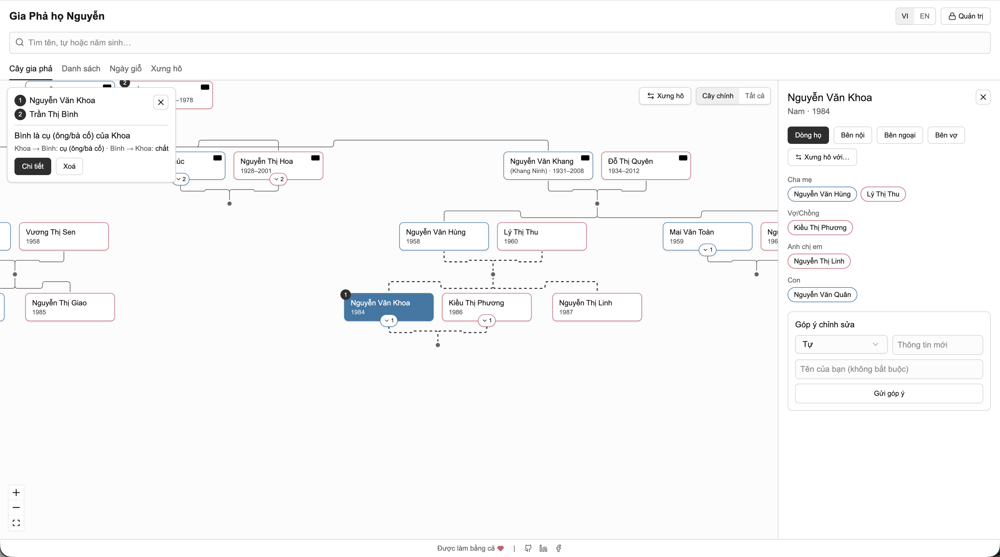

# 🌳 Vietnamese Family Tree

A simple, friendly way to explore a family tree, understand kinship terms, and keep track of lunar memorial days.



## 💡 Why it’s useful

It helps families remember where they come from, how relatives address one another, and when to gather for memorial days. It keeps family records easy to share and easy to update.

## ✨ Features

**🌿 Tree view**

- Browse the family tree with collapsible branches and quick search.
- Start with the main house or view the whole tree.
- Jump straight to a match by name, courtesy name, or birth year.

**📚 Directory and editing**

- Search and filter relatives by generation level and gender, with birth dates in both solar and lunar calendars.
- Suggest updates to a record and let an admin review them.
- Switch between Vietnamese and English anytime.
- Light, dark, or system theme, remembered across visits.

**🕯️ Memorial days**

- Track lunar death anniversaries and see upcoming reminders.
- View today’s lunar date and remaining days for each memorial.

**🤝 Kinship**

- Compare any two people and see their relationship in both directions.
- Support Northern and Southern Vietnamese terms of address, switchable in the kinship view (bố/mẹ or ba/má, cụ or ông cố, bác or cô/cậu/dì for a parent's older siblings).

## 🚀 Getting started

```bash
npm install
npm run dev
```

## 🧩 Built with

- [TanStack Start](https://tanstack.com/start) and [TanStack Router](https://tanstack.com/router)
- [React Flow](https://reactflow.dev/)
- [Tailwind CSS](https://tailwindcss.com/) and [shadcn/ui](https://ui.shadcn.com/)
- [Nitro](https://nitro.build/)
